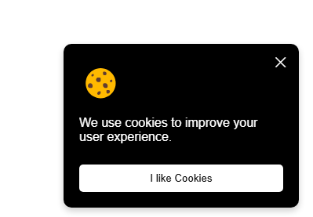

# Cookie Consent

A simple cookie consent popup that appears when the user visits the page. The popup includes a message and a button to accept the consent. Once accepted, the popup will disappear. 

